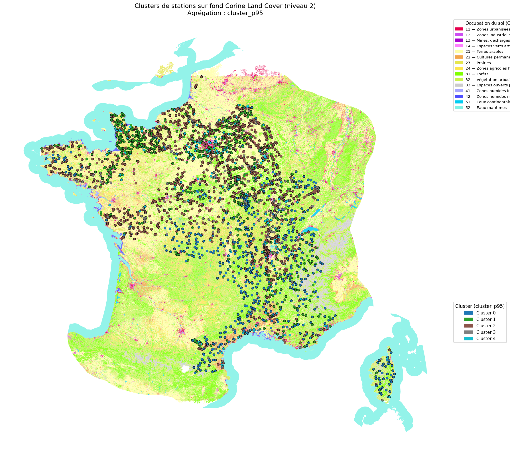

# Hydro Quality Clustering

Clustering French river monitoring stations into water-quality profiles from the national NAIADES dataset, then checking whether those profiles line up with the land use around each station.

Coursework project for the Complex Data course (M1 Data Science and Complex Systems, University of Strasbourg). The assignment: *define quality classes for monitoring stations in relation to their geographic location.*

## Overview

The pipeline works in three stages:

1. **Cleaning** — start from raw NAIADES physico-chemical measurements, keep the 15 most frequently measured parameters, and build a clean station × sampling-date table.
2. **Clustering** — aggregate each station's yearly readings and run KMeans (k = 5, matching the SANDRE/SEQ-Eau quality classes) to assign a quality profile to every station.
3. **Geography** — cross the resulting clusters against Corine Land Cover categories and map them, to see whether water quality tracks land use.

Short answer to the assignment's question: yes — for example, cluster 0 skews more forested, cluster 4 is more dominated by arable land.



## Dataset

- **NAIADES** (French water quality monitoring network) — physico-chemical analyses, sampling operations, and station metadata for 2022.
- **Corine Land Cover** (EPSG:2154) — land-use polygons, used at level 2 (14 categories) for the cluster/land-use crosswalk.

Raw files are not versioned in this repo (several hundred MB to >1 GB); see [Getting started](#getting-started) for where to get them.

## Method

- Of all physico-chemical parameters recorded, only the **15 most frequently measured** are kept, and only samples where all 15 are present together (no imputation).
- Each station gets two cluster labels, both KMeans with **k = 5**:
  - `cluster_mean` — annual mean of the raw, standardized values.
  - `cluster_p95` — 95th-percentile aggregation over SEQ-Eau quality classes, which is closer to real regulatory practice since it surfaces poor readings instead of averaging them away. This is the label used for the geographic analysis.
- Clusters are crossed against Corine Land Cover level-2 categories (station-level point overlay) to compare quality profiles against surrounding land use.

## Results

| Output | Description |
|---|---|
| `outputs/tables/tp1_clean_dataset.csv` | Cleaned station × sample table, 19,349 rows × 18 columns |
| `outputs/tables/tp2_station_clusters.csv` | Cluster labels per station, 2,936 rows |
| `outputs/tables/tp3_crosstab_cluster_clc_*.csv` | Cluster × land-use cross-tabulations (counts and %) |
| `outputs/figures/carte_clusters_p95_clc_niv2.png` | Main map — clusters over Corine Land Cover |
| `outputs/figures/heatmap_cluster_clc.png` | Cluster × land-use heatmap |

The `outputs/` notebooks (`*_executed.ipynb`) already contain a full clean run — open them directly to see the statistics, clustering, and maps without installing anything.

A separate, more detailed **[written report](rapport.md)** applies the same methodology to a regional case study (Rhin-Meuse basin, 2013), with a full statistical writeup and an interpretation of clusters against relief and land use.

## Project structure

```
.
├── notebooks/                         Notebooks to run, in order
│   ├── TP1_etude_preliminaire.ipynb
│   ├── TP2_agregation_clustering.ipynb
│   └── TP3_visualisation_geo.ipynb
├── outputs/                           Results: executed notebooks, tables, figures
├── data/
│   ├── raw/                           NAIADES data (not versioned)
│   ├── reference/                     Assignment brief, SEQ-Eau grids, SANDRE class table
│   └── geo/                           Corine Land Cover (not versioned)
├── archive/                           Reference notebooks provided by the course
└── rapport.md                         Full written report (regional case study)
```

## Getting started

### Prerequisites

Python 3.12 with `pandas numpy matplotlib seaborn scikit-learn geopandas shapely zstandard pyogrio`.

### Data

The raw data files are too large to version and need to be placed manually:

| File | Size | Notes |
|---|---|---|
| `data/raw/analyses_2022.csv.zst` | ~101 MB | NAIADES analyses |
| `data/raw/stations.csv.zst` | — | NAIADES station metadata |
| `data/raw/operations_2022.csv.zst` | — | NAIADES sampling operations |
| `data/geo/CLC_PNE_RG/CORINE_LAND_COVER_FRANCE_METROPOLITAINE_EPSG2154.gpkg` | ~1.26 GB | see `data/reference/corine-land-cover.txt` for the download link |

### Running the pipeline

```bash
# in order, each produces the inputs for the next
notebooks/TP1_etude_preliminaire.ipynb      # -> outputs/tables/tp1_clean_dataset.csv
notebooks/TP2_agregation_clustering.ipynb   # -> outputs/tables/tp2_station_clusters.csv
notebooks/TP3_visualisation_geo.ipynb       # -> maps and cross-tabs in outputs/figures & outputs/tables
```
